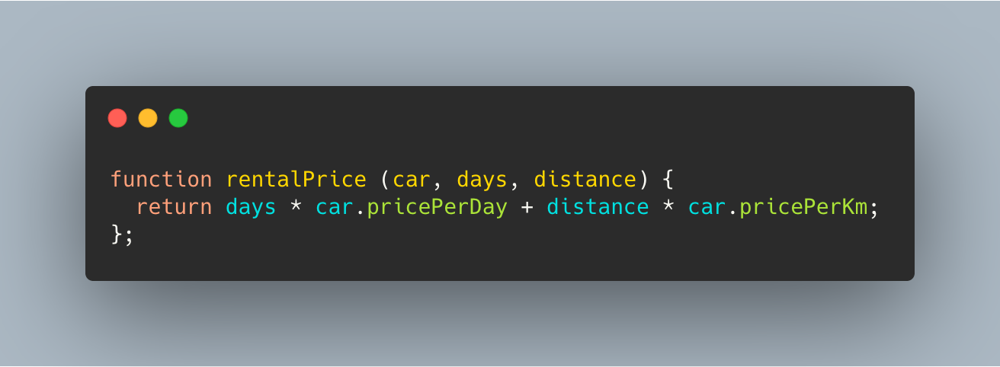
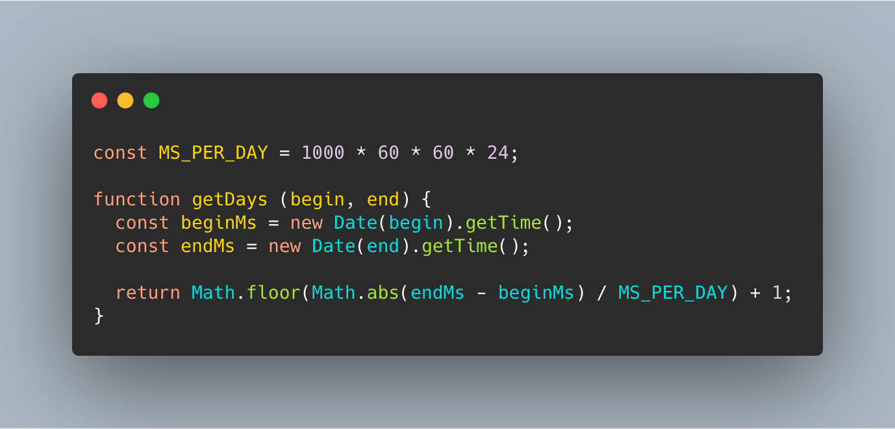
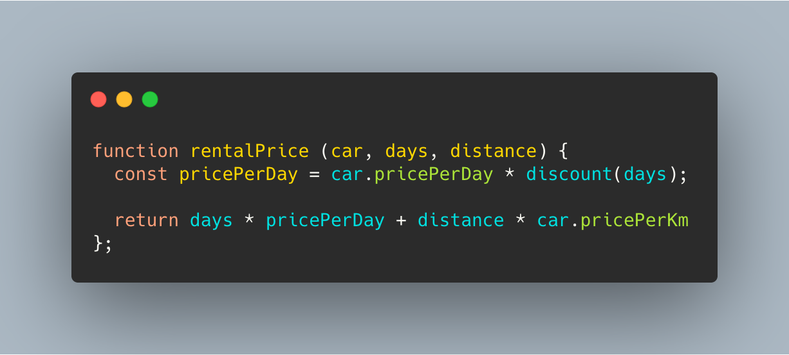
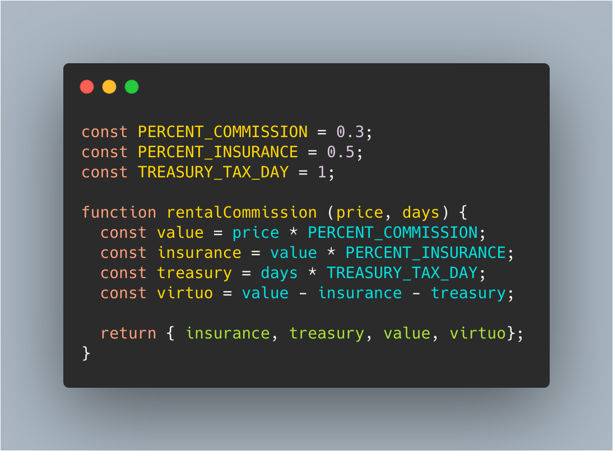
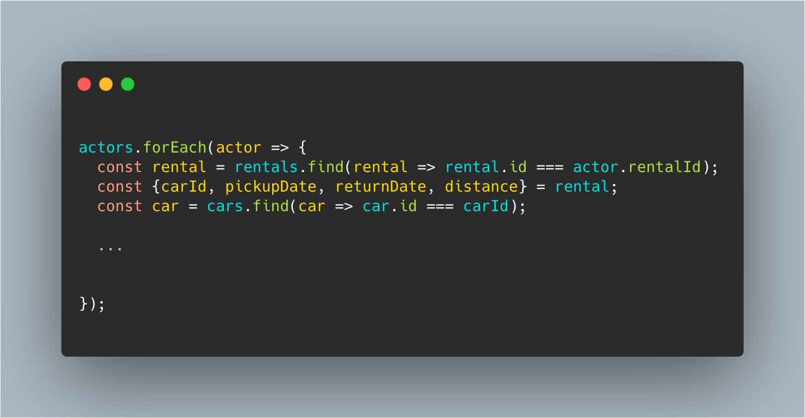
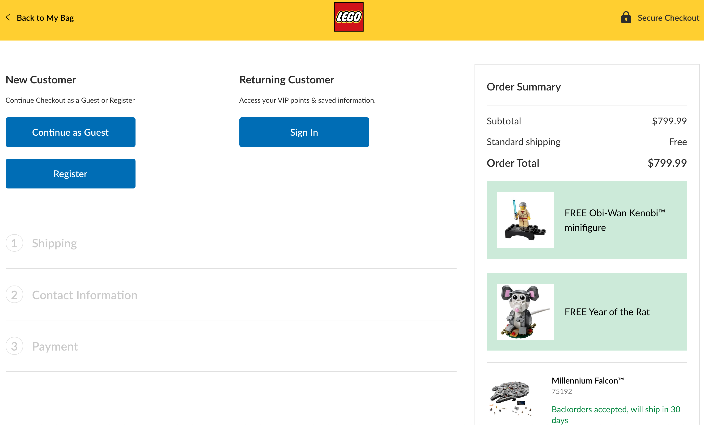
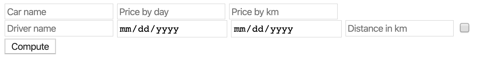
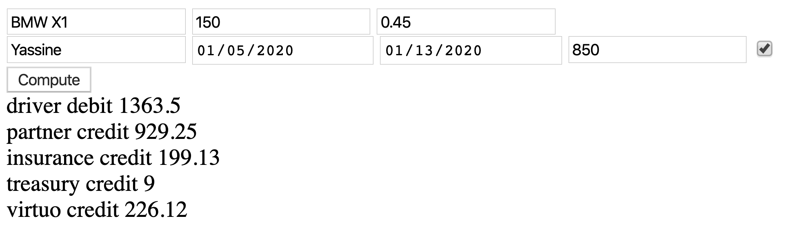

[join.slack.com](https://join.slack.com/t/esilv-s8-2020/shared_invite/enQtOTA2ODU3ODU1NzY2LTdhMmEwMGQ1NmMyZmJlZGU2MDE4MGNmMDMyMDE3OGE3NTllNzYzY2JhMTEyYzM5MmU3NzY1OGMzYTUxNDFmMjQ)

---

(programming) language

---

---

---

---

---

---

---

Continue as guest

---

💶

$300 Million

---

[The results](https://www.fastcompany.com/1147825/300-million-continue-button):

* Number of customers purchasing went up by 45%

---

* Extra $15 Million the first month

---

🎯 Build a clean page that computes the debit and credit price of each actors

---

🏃‍♀️ Steps to do

---

## [92bondstreet/dress-up-virtuo](https://github.com/92bondstreet/dress-up-virtuo)

---

* Help users to understand your page event they don’t know anything about your site

---

* Help users to compute the invoices in a clear and efficient manner

---

* Help users to be clear about which action to take in a easy manner

---

👩‍💻 Just tell me what to do

---

* Fork the project via `github`

---

* Clone the project

---

* Open /public/index.html in your browser

---

* Check the browser web page

---

---

---

* Commit early, commit often

---

* Don't forget to push before the end of the workshop

---

[join.slack.com](https://join.slack.com/t/esilv-s8-2020/shared_invite/enQtOTA2ODU3ODU1NzY2LTdhMmEwMGQ1NmMyZmJlZGU2MDE4MGNmMDMyMDE3OGE3NTllNzYzY2JhMTEyYzM5MmU3NzY1OGMzYTUxNDFmMjQ)
